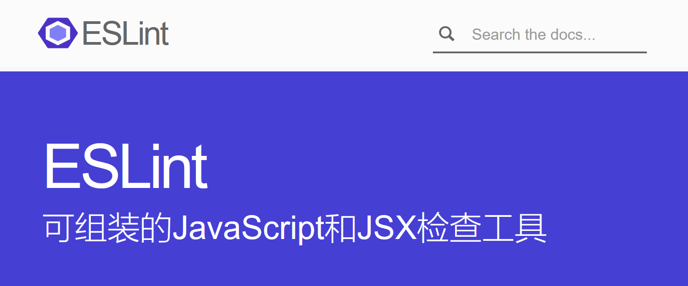
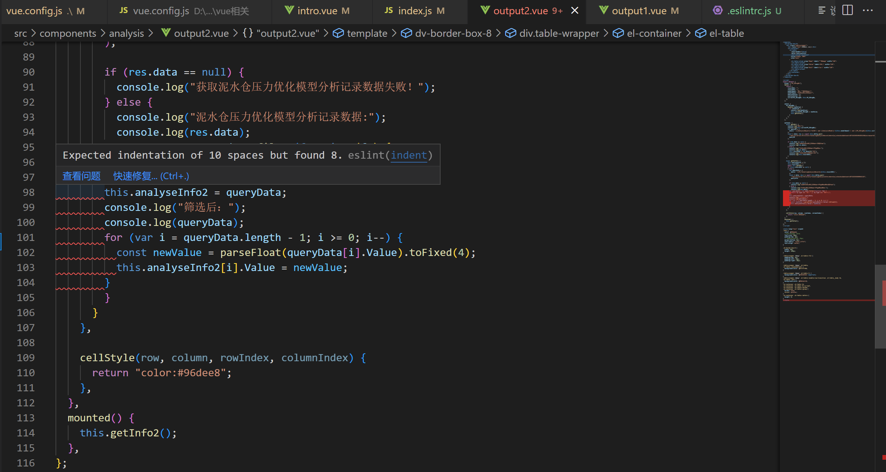
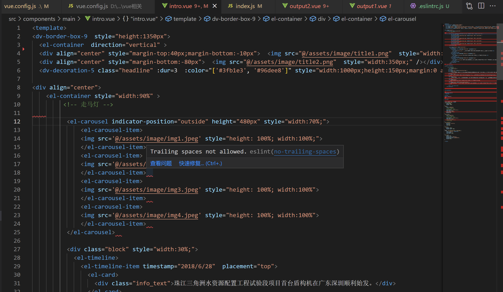
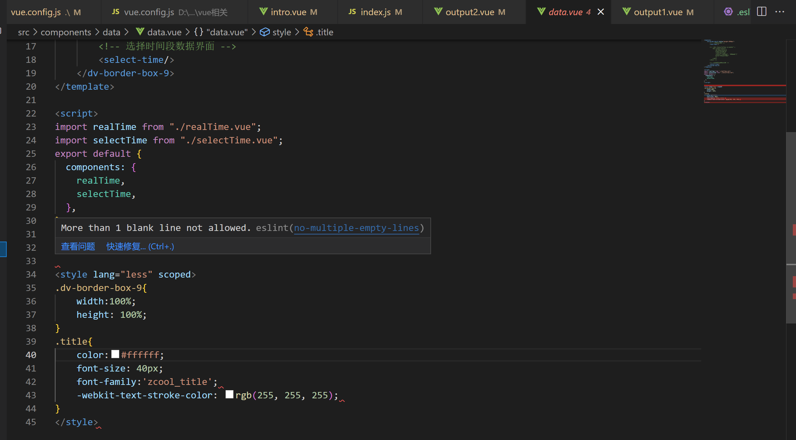
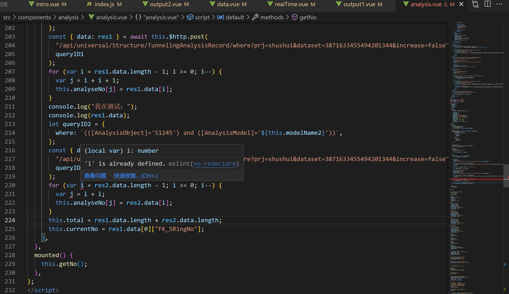
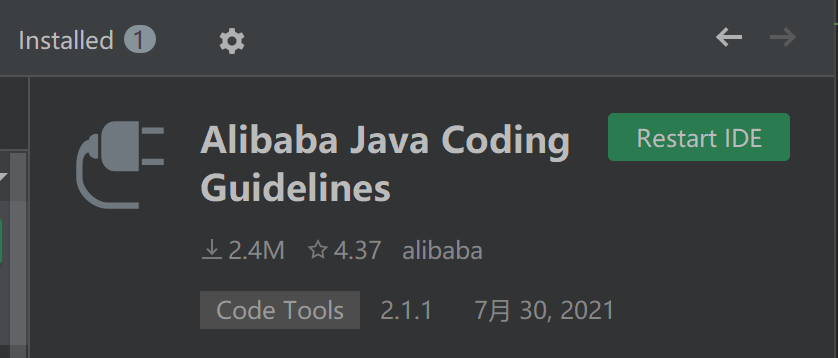
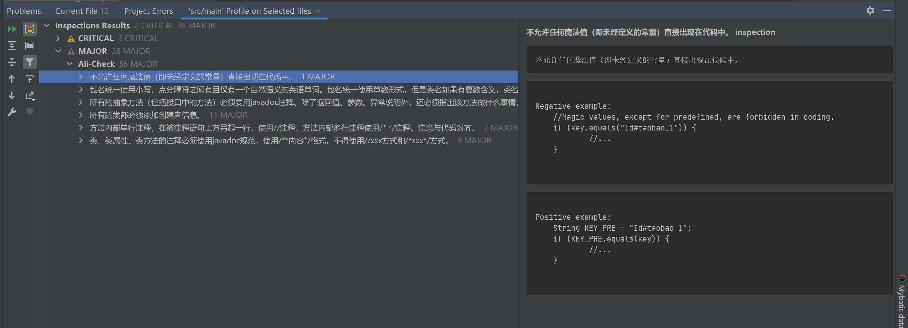
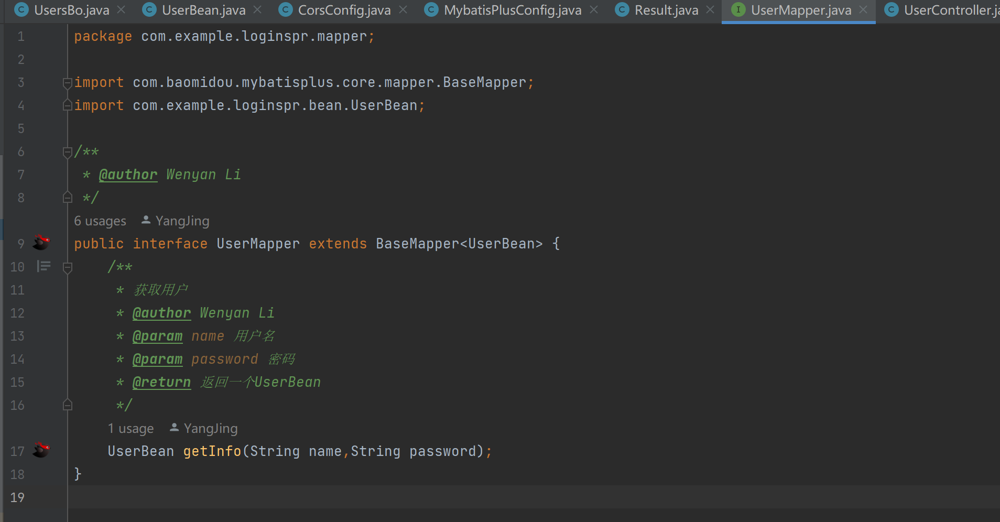

# 一、单元测试

> 参照教材P155的单元测试一章制定单元测试计划，选择3~4个有代表性的类进行单元测试。详细描述单元测试用例的分析和设计过程、使用的测试方法，有对应的软件测试用例集列表，在测试用例表中标注测试用例来源于何种测试方法。描述测试的执行过程，在测试用例表中标注bug，bug的解决情况，形成自定义的测试报告（可以有饼状图等），并保存有不同的被测单元的版本。单元测试时首先在特定的IDE中进行代码的静态测试（如Checkstyle等），之后在特定的IDE中用单元测试工具完成动态测试，如，JUNIT。利用缺陷跟踪工具进行bug的跟踪。

## 1.1 代码静态测试

### 1.1.1 前端代码质量静态审查

#### 1）工具

Eslint

#### 2）测试结果

### 1.1.2 后端代码质量静态审查

#### 1）工具

#### 2）测试结果

## 1.2 登录注册单元测试

## 1.3 数据展示单元测试

## 1.4 机器学习分析单元测试

# 二、集成测试

> 参照教材P198的集成测试一章制定集成测试计划，详细描述集成测试策略，根据集成测试策略详细描述集成测试依据（即被测系统的前端和后端接口、后端类方法之间的接口及与第三方系统的接口关系图），用例的分析和设计过程、使用的测试方法及测试用例集列表，在测试用例表中标注测试用例的覆盖情况（如覆盖哪个接口）。描述测试的执行过程，在测试用例表中标注bug，bug的解决情况，形成自定义的测试报告（可以有饼状图等），并保存有不同的集成测试版本。

# 三、系统测试

> 参照教材P275系统测试一章制定系统测试计划，详细描述系统功能测试用例的分析和设计过程、使用的测试方法，有对应的软件测试用例集列表，在测试用例表中标注测试用例的覆盖情况（如系统业务功能覆盖、外部接口覆盖等）。描述测试的执行过程，在测试用例表中标注bug，bug的解决情况，形成自定义的测试报告（可以有饼状图等），并保存有不同的系统测试版本。

## 3.系统性能测试

> P212&在许可的条件下，尝试完成系统的性能测试：在特定的测试环境下，利用开源的性能测试工具（自己定）完成这个系统的性能测试，得出在特定环境下系统的性能指标，如，吞吐量（同时服务的用户数）、每笔交易的平均时间等。
