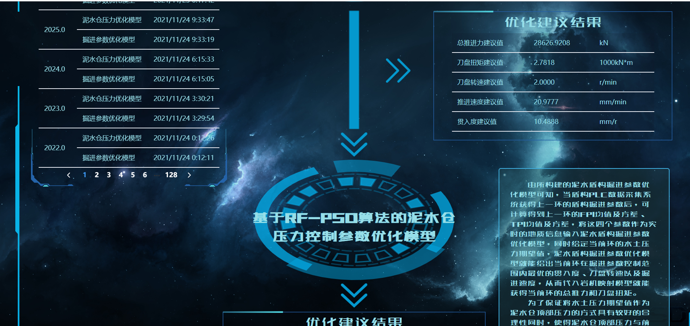
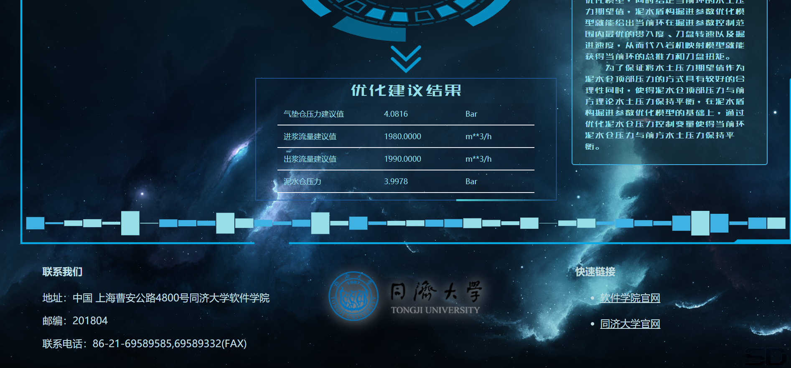

修订历史:

修改或初始编写日期、 SEPG、 版本、 说明、 作者、 评审时间、 评审参与人员、 评审后修改批准日期、确认签字人员

目　录

# 1. 引言 yj

## 1.1. 概要设计目的和依据

编写这份概要说明书的目的是简要介绍本项目的架构设计、接口设计、界面设计、数据库设计以及出错处理。本文档的预期读者是与本项目开发有联系的决策人、开发组人员、支持本项目的利益相关者等。

本概要设计依据文件：超链接到需求分析说明书。

## 1.2. 参考资料 

需求分析说明书

## 1.3. 假定和约束 

系统运行使用的最短寿命：3年

经费来源和使用限制：无经费

法律和政策限制：不得随意泄露数据

建议投入使用的最迟时间：2022年1月

用户假设：本系统的用户能够操作键盘和鼠标，能够浏览简单的网站。

# 2. 概要设计

## 2.1. 系统总体架构设计 lwy

参考第二份作业的SDS的P6

以需求分析为依据，进一步详细设计系统的总体架构设计。本系统服务器端设计以实现各模块间的低耦合及模块内部的高内聚为导向，系统被具体细分为四个层 ：应用层（ApplicationLayer）、业务层（ServiceLayer）、数据层（DataLayer）以及服务层（ServerLayer）。

1. 应用层：主要包含了当前web前端的技术需求。PC端主要采用Vue框架，并通过ElementUI、DataV、ECharts等组件库构造快速动态的大屏数据展示页面，通过axios发送http请求。无论是用户还是管理者，均通过应用层提供的Web 服务器使用本平台所提供的功能，发送的信息将被统一转化为JSON格式的数据发送到服务层。
2. 业务层中：本层的接口按照对应的子系统进行划分为：账户管理子系统、PCL数据采集子系统、分析记录存储子系统。之后随着业务需求更新可增加其他业务子系统。
3. 数据层：主要实现的是本平台数据库的访问和配置。访问的方式主要为JDBC，并且我们使用 Java 中的 ORM 框架 MyBatis 简化代码，提高开发效率。而底层数据库则包含了关系型数据库 MySQL。
4. 服务层：基于SpringBoot进行开发定义了若干API接口。负责对用户的 http 请求作出响应，处理本系统的核心业务逻辑。

## 2.2. 系统软件结构设计 yj

可参考第二份作业的SDS的P8

## 2.3. 接口设计 yj（和外面的）&lwy（前后端）

对2.2节中的类之间的接口，模块之间的接口，对接口作详细描述。

本系统和其他系统的接口，对接口作详细描述。

### 2.3.1 注册接口

| 接口    | register                                                     |
| ------- | ------------------------------------------------------------ |
| 描述    | 本接口用于用户注册账号功能，实现了用户与账户管理子系统的交互，在User、LoginPage、UserController之间协作完成。 |
| URL接口 | POST /api/register                                           |
| 变量    | username:String password:String email:String Ecode:String |
| 返回    | 成功信息或错误信息                                           |

### 2.3.2 登录接口

| 接口    | login                                                        |
| ------- | ------------------------------------------------------------ |
| 描述    | 本接口用于用户登录网站功能，实现了用户与账户管理子系统的交互，在User、LoginPage、UserController之间协作完成。 |
| URL接口 | POST /api/login                                              |
| 变量    | username:String password:String                           |
| 返回    | 成功信息或错误信息                                           |

### 2.3.3 发送邮件接口

| 接口    | email                                                        |
| ------- | ------------------------------------------------------------ |
| 描述    | 本接口用于用户注册账号功能，实现了用户与账户管理子系统的交互，在User、LoginPage、UserController之间协作完成。 |
| URL接口 | POST /api/email                                              |
| 变量    | email:String                                                 |
| 返回    | 成功信息和验证码内容或错误信息                               |

（与外部的）

## 2.4. 界面设计 yj&lwy

### 2.4.1 登录界面

内容元素：

1. 数据分析及可视化项目标题
2. 登录表单输入框
3. 登陆注册按钮

### 2.4.2 注册界面

内容元素：

1. 数据分析及可视化项目标题
2. 注册表单输入框
3. 发送验证码按钮
4. 登陆注册按钮

### 2.4.3 机器学习界面

内容元素：

1. 掘进参数优化模型和泥水仓控制参数优化模型介绍
2. 两个模型分析结果
3. 当前展示环号信息
4. 分析环号展示列表和筛选框
5. 项目承担单位简介与链接

## 2.5 数据库设计 lwy

依据“软件需求（分析）规约（说明书）”的数据建模进行数据库逻辑设计和物理设计。指出本软件系统内部所使用的每个数据库结构的名称、标识符以及它们之中每个数据项、记录、文卷和系的标识、定义、长度以及它们之间的层次的或表格的相互关系。给出本系统内部所使用的每个数据库结构中的每个数据项的存储要求，访问方法、存取单位、存取的物理关系（索引、设备、存储区域）、设计考虑等。

## 2.6 系统出错处理设计 yj&lwy

### 2.6.1 出错信息

可以用一览表的形式说明每种可能出现错误或故障情况发生时，系统输出信息的形式、含义及处理的方法。

### 2.6.2 补救措施

说明故障出现后可能采取的变通措施。

### 2.6.3 系统维护设计

说明为了系统维护的方便而在程序内部设计中作出的安排，包括在程序中专门安排用于系统的检查与维护的检测点和专用模块（或）类。

# 附录