修订历史:

| 编写日期   | SEPG | 版本 | 说明                              | 作者   | 评审时间 | 参与人员 | 批准日期 | 确认人员 |
| ---------- | ---- | ---- | --------------------------------- | ------ | -------- | -------- | -------- | -------- |
| 2021/11/24 | GF   | 0.1  | 文档框架搭建                      | 杨晶   |          |          |          |          |
| 2021/11/28 | GF   | 0.2  | 功能需求和非功能需求编写          | 李文妍 |          |          |          |          |
| 2021/11/30 | GF   | 0.3  | 引言 、运行环境和需求跟踪管理撰写 | 杨晶   |          |          |          |          |
|            | GF   | 1.0  | 定稿校对                          |        |          |          |          |          |

# 1. 引言

## 1.1. 概要设计目的和依据

编写这份概要说明书的目的是简要介绍本项目的架构设计、接口设计、界面设计、数据库设计以及出错处理。本文档的预期读者是与本项目开发有联系的决策人、开发组人员、支持本项目的利益相关者等。

本概要设计依据文件：需求分析说明书

## 1.2. 参考资料 

[1]新华社:全长113公里 入地40-60米 珠江三角洲水资源配置工程正式开工  https://baijiahao.baidu.com/s?id=1632783242754928557&wfr=spider&for=pc

[2]张品. 基于机器学习算法的盾构掘进地表沉降预测及控制[D].湖南大学,2019.DOI:10.27135/d.cnki.ghudu.2019.000005.

[3]IEEE-SA Standards Board, “IEEE Recommended Practice for Software Requirements Specifications”, Software Engineering Standards Committee of the IEEE Computer Society, June 25th, 1998

## 1.3. 假定和约束 

系统运行使用的最短寿命：3年

经费来源和使用限制：无经费

法律和政策限制：不得随意泄露数据

建议投入使用的最迟时间：2022年1月

用户假设：本系统的用户能够操作键盘和鼠标，能够浏览简单的网站。

# 2. 概要设计

## 2.1 系统总体架构设计

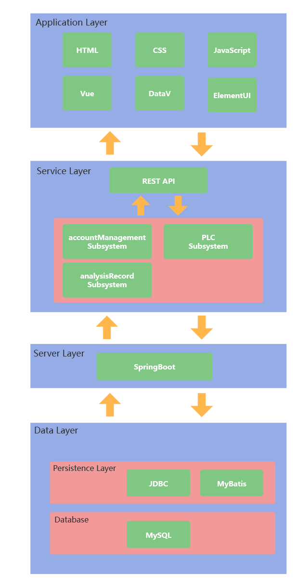

以需求分析为依据，进一步详细设计系统的总体架构设计。本系统服务器端设计以实现各模块间的低耦合及模块内部的高内聚为导向，系统被具体细分为四个层 ：应用层（ApplicationLayer）、业务层（ServiceLayer）、数据层（DataLayer）以及服务层（ServerLayer）。

1. 应用层：主要包含了当前web前端的技术需求。PC端主要采用Vue框架，并通过ElementUI、DataV、ECharts等组件库构造快速动态的大屏数据展示页面，通过axios发送http请求。无论是用户还是管理者，均通过应用层提供的Web 服务器使用本平台所提供的功能，发送的信息将被统一转化为JSON格式的数据发送到服务层。
2. 业务层中：本层的接口按照对应的子系统进行划分为：账户管理子系统、PCL数据采集子系统、分析记录存储子系统。之后随着业务需求更新可增加其他业务子系统。
3. 数据层：主要实现的是本平台数据库的访问和配置。访问的方式主要为JDBC，并且我们使用 Java 中的 ORM 框架 MyBatis 简化代码，提高开发效率。而底层数据库则包含了关系型数据库 MySQL。
4. 服务层：基于SpringBoot进行开发定义了若干API接口。负责对用户的 http 请求作出响应，处理本系统的核心业务逻辑。

## 2.2 系统软件结构设计 

本项目的部署图如下

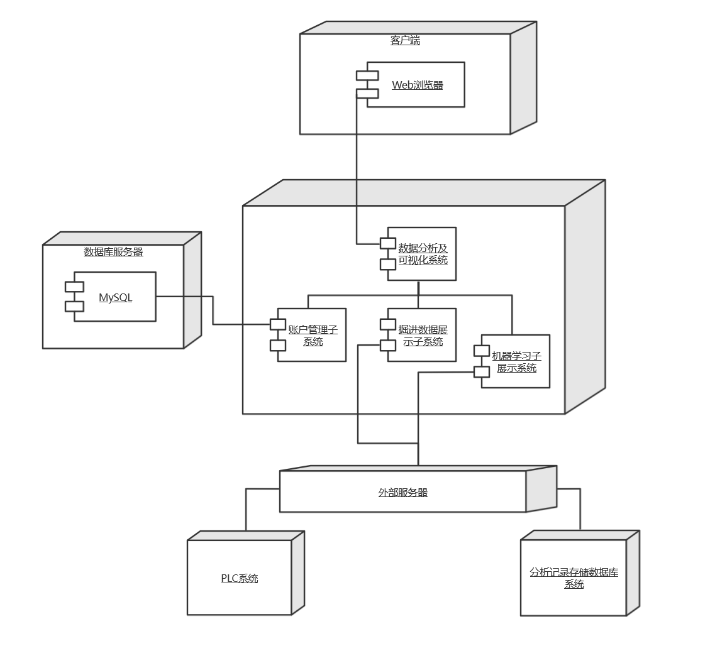

本项目的体系结构环境图如下

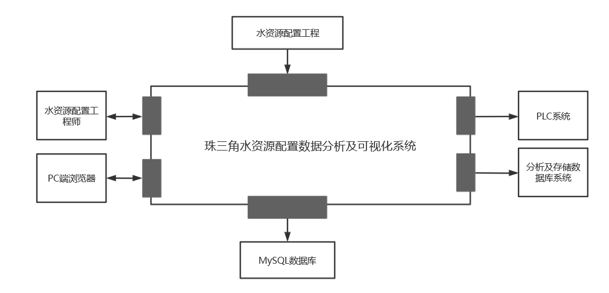

## 2.3 接口设计

### 2.3.1 注册接口

| 接口    | register                                                     |
| ------- | ------------------------------------------------------------ |
| 描述    | 本接口用于用户注册账号功能，实现了用户与账户管理子系统的交互，在User、LoginPage、UserController之间协作完成。 |
| URL接口 | POST /api/register                                           |
| 变量    | username:String password:String email:String Ecode:String |
| 返回    | 成功信息或错误信息                                           |

### 2.3.2 登录接口

| 接口    | login                                                        |
| ------- | ------------------------------------------------------------ |
| 描述    | 本接口用于用户登录网站功能，实现了用户与账户管理子系统的交互，在User、LoginPage、UserController之间协作完成。 |
| URL接口 | POST /api/login                                              |
| 变量    | username:String password:String                           |
| 返回    | 成功信息或错误信息                                           |

### 2.3.3 发送邮件接口

| 接口    | email                                                        |
| ------- | ------------------------------------------------------------ |
| 描述    | 本接口用于用户注册账号功能，实现了用户与账户管理子系统的交互，在User、LoginPage、UserController之间协作完成。 |
| URL接口 | POST /api/email                                              |
| 变量    | email:String                                                 |
| 返回    | 成功信息和验证码内容或错误信息                               |

### 2.3.4 按时间获取掘进数据接口

| 接口类型 | POST                                                         |
| -------- | ------------------------------------------------------------ |
| 描述     | 本接口用于和PLC系统交互一段时间内的掘进数据                  |
| URL接口  | /api/universal/Monitoring/MonDataEqu_shushui/where?prj=shushui&dataset=3835049491879165952 |
| 变量     | body参数（json格式）{"where":"([t]>='2021-09-17 23:56:00' and [t]<='2021-09-17 23:59:00')"} |
| 返回     | 记录掘进数据的数组                                           |

### 2.3.5 根据设备编号和模型名称获取分析记录接口

| 接口类型 | POST                                                         |
| -------- | ------------------------------------------------------------ |
| 描述     | 本接口用于和外部分析记录存储子系统进行交互，按照设备编号和模型名称获取分析记录系统交互获取分析记录数据 |
| URL接口  | /api/universal/Structure/TunnelingAnalysisRecord/where?prj=shushui&dataset=3871633455494201344&pagesize={pagesize}&pageindex={pageindex} |
| 变量     | body参数（json格式）{"where":"(([AnalysisObject]='S1245') and ([AnalysisModel]='{模型名称}'))"} |
| 返回     | recordID，供接口2.3.6使用                                    |

### 2.3.6 根据分析记录ID获取分析信息

| 接口类型 | POST                                                         |
| -------- | ------------------------------------------------------------ |
| 描述     | 本接口用于和外部分析记录存储子系统进行交互，按照分析结果的ID获取分析结果的详情数据。 |
| URL接口  | /api/universal/Structure/TunnelingAnalysisInfo/where?prj=shushui&dataset=3871633545889841152 |
| 变量     | body参数（json格式）{"where":"([FK_TunnelingAnalysisRecord]=\'{recordID}\')"} |
| 返回     | 成功信息和验证码内容或错误信息                               |

## 2.4. 界面设计

### 2.4.1 登录界面

内容元素：

1. 数据分析及可视化项目标题
2. 登录表单输入框
3. 登陆注册按钮

### 2.4.2 注册界面

内容元素：

1. 数据分析及可视化项目标题
2. 注册表单输入框
3. 发送验证码按钮
4. 登陆注册按钮

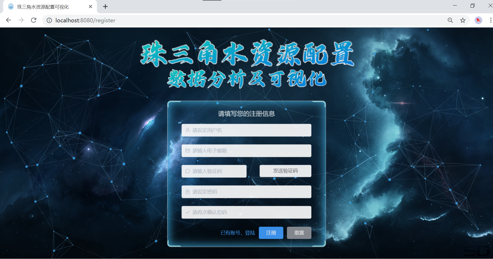

### 2.4.3 项目介绍界面

内容元素：

1. 走马灯图片展示
2. 珠三角水资源配置工程文字介绍
3. 同济大学页脚

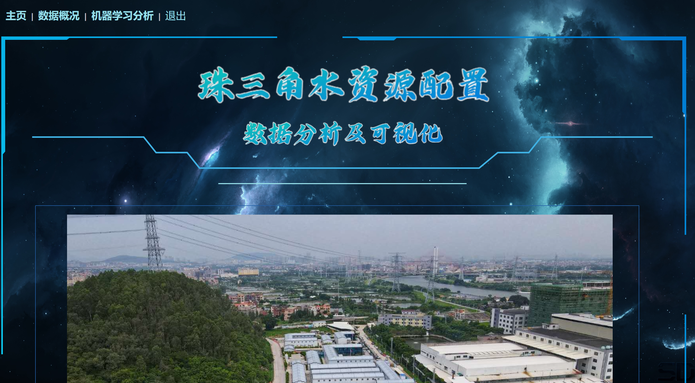

### 2.4.4 掘进数据展示界面

内容元素：

1. 实时数据展示框
   1. 当前掘进环号、状态展示框；
   2. 总推力、贯入度、扭矩、推进速度、刀盘转速随时间变化的折线图
2. 历史数据展示框
   1. 数据所属状态切换按钮
   2. 时间段选择框以及搜索、下载按钮
   3. 引导说明文字
   4. 总推力、贯入度、扭矩、推进速度、刀盘转速随时间变化的折线图

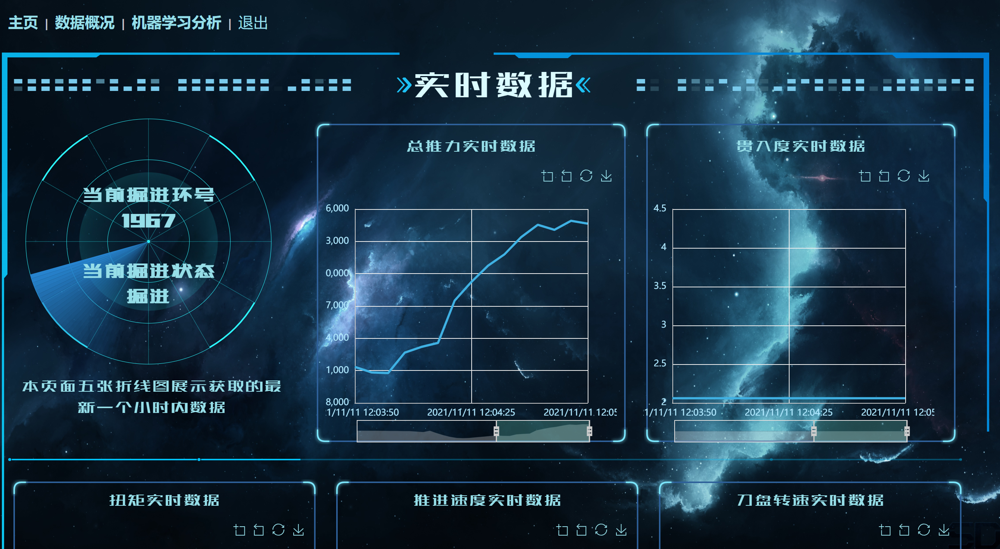

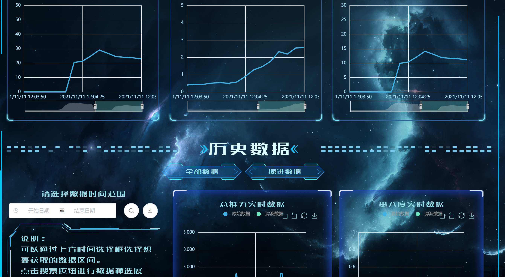

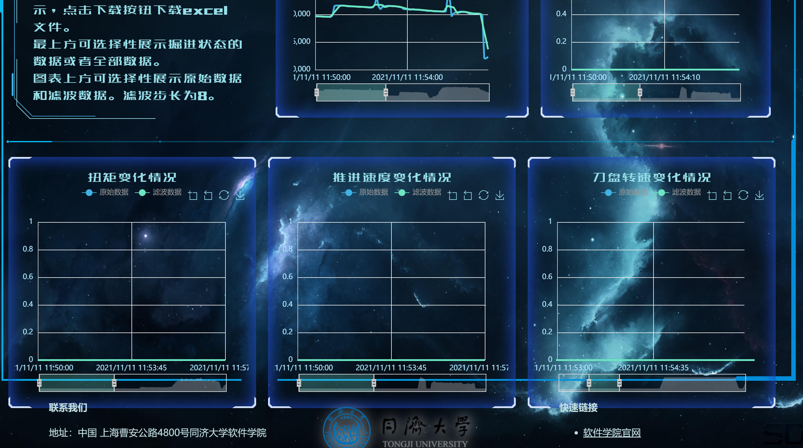

### 2.4.4 机器学习界面

内容元素：

1. 掘进参数优化模型和泥水仓控制参数优化模型介绍
2. 两个模型分析结果
3. 当前展示环号信息
4. 分析环号展示列表和筛选框
5. 项目承担单位简介与链接

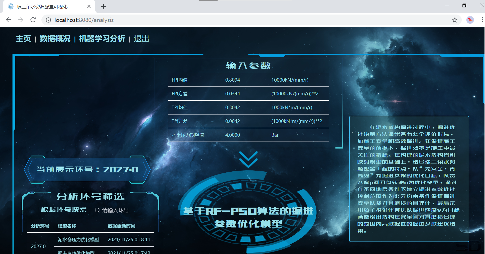

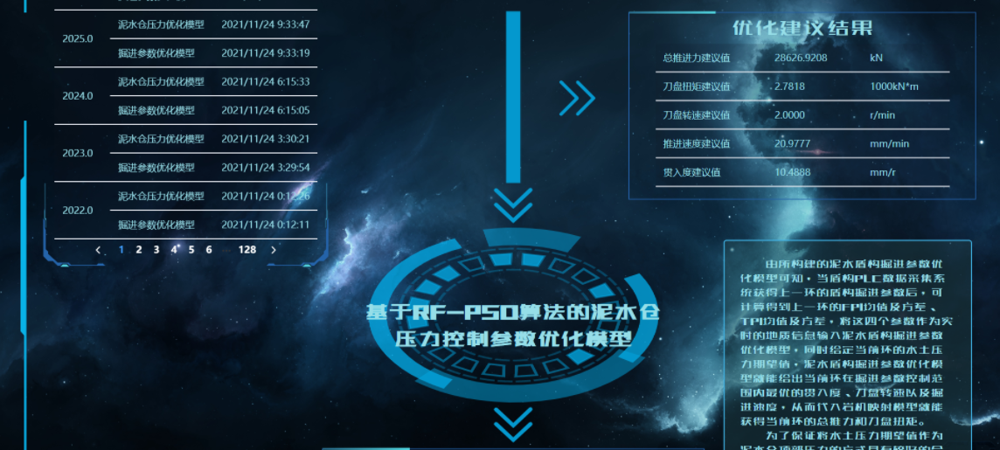

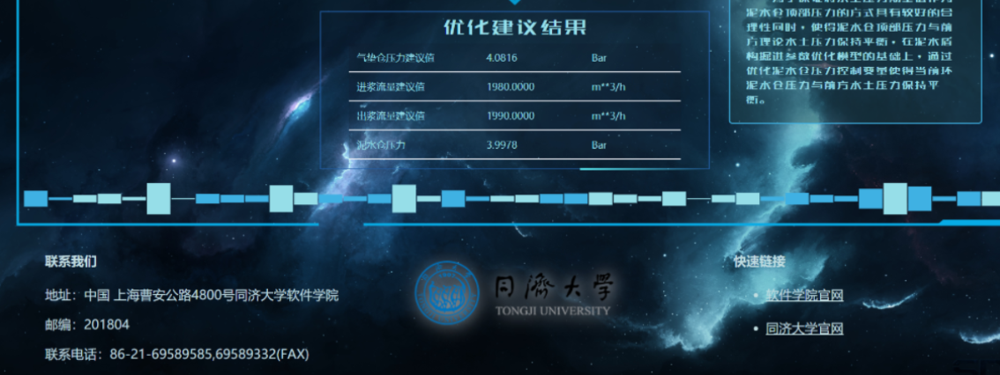

## 2.5 数据库设计

​		依据“软件需求（分析）规约（说明书）”的数据建模进行数据库逻辑设计和物理设计。指出本软件系统内部所使用的每个数据库结构的名称、标识符以及它们之中每个数据项、记录、文卷和系的标识、定义、长度以及它们之间的层次的或表格的相互关系。给出本系统内部所使用的每个数据库结构中的每个数据项的存储要求，访问方法、存取单位、存取的物理关系（索引、设备、存储区域）、设计考虑等。

​		本项目采用MySQL数据库进行用户数据的存储，根据项目的以下需求，分析了数据库的逻辑结构，最后设计了这部分的数据库结构。

### 2.5.1 数据需求

​		为了实现系统的功能，需要对以下数据进行存储：

#### 2.5.1.1 用户数据

职责：存储用户的个人信息

内容：id，密码，用户名，邮箱，注册验证码

#### 2.5.1.2 掘进数据

职责：存储对应时间节点的掘进信息

内容：时间，掘进状态，总推力，贯入度，扭矩，推进速度，刀盘转速

#### 2.5.1.2 掘进分析信息

职责：记录机器学习的掘进分析信息

内容：项目名称，数据，单位，类别，所属分析记录

### 2.5.2 实体关系

​		上述数据需求是需要存储的内容，除了内容本身之外，还需要将实体类之间的关系合并到数据库的设计中。

（我们没有实体关系）

### 2.5.3 表结构

​		结合以上信息，可以设计出完整的数据库结构。

​		注意：表中的类型是Java类型，不是MySQL类型。

#### 2.5.3.1 User

| Name     | Type   | Description    |
| -------- | ------ | -------------- |
| ID       | int    | 用户的ID，主键 |
| username | String | 用户名         |
| password | String | 密码           |
| email    | String | 邮箱           |

#### 2.5.3.2 UserBo

| Name  | Type   | Description          |
| ----- | ------ | -------------------- |
| email | String | 邮箱                 |
| code  | String | 系统生成的邮箱验证码 |

#### 2.5.3.2 要写外部数据的表吗？不要

不要了吧，根本不知道他们系统的数据库里面有什么表

### 2.5.4 实体类

（之后补图，不确定要不要外部数据实体是表）

## 2.6 系统出错处理设计

| 错误或故障               | 系统输出信息         | 变通措施           |
| ------------------------ | -------------------- | ------------------ |
| PLC系统实时接口不稳定    | 无输出               | 渲染过往存储的数据 |
| 用户选择的时间段没有数据 | 界面提示“所选无数据” | 无                 |
|                          |                      |                    |

# 附录

