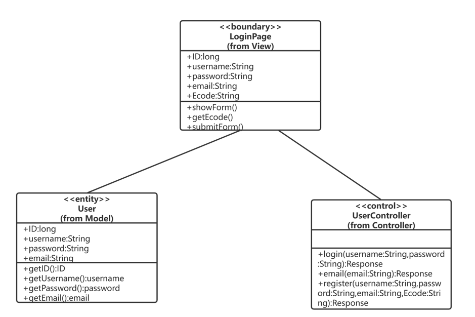
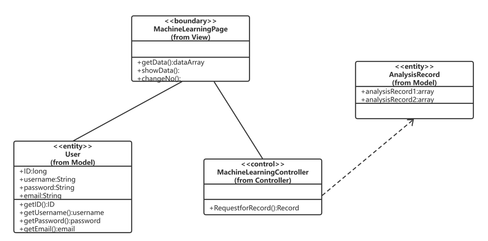
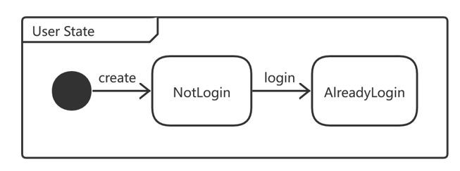
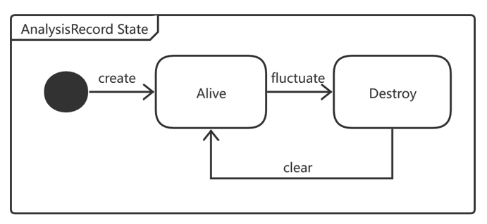

# **1**        **引言 **yj

## 1.1     编写目的

本文档的目的是对珠三角水资源配置工程可视化进行一个系统、详尽的描述。软件需 求规约文档（SDS）显示了如何构建软件系统以满足软件需求规范（SRS）中明确的 需求。它是将需求转换为对实现阶段所需的软件结构，软件组件，接口和数据的描 述。本文档可作为项目实施的指南。同时，需要升级或修改当前系统的设计人员也 可以参考此文档。

软件详细设计规约是项目设计的第三个阶段， 这个阶段的主要任务是在软件需求规约的基础上，对概要设计中产生的功能模块进行过程描述，设计功能模块的内部细节，包括类的详细逻辑和接口及类之间的调用 关系，为编写源代码提供必要的说明。 

本文档的目的旨在推动软件工程的规范化，使设计人员遵循统一的详细设计书 写规范，节省制 作文档的时间，降低系统实现的风险，做到系统设计资料的规范性 与全面性，以利于系统的实现、测试、维护、版本升级等。 

概要设计解决了软件系统总体结构设计的问题，包括整个软件系统的结构、模块划分、模块功能和模块间的联系等。详细设计则要解决如何实现各个模块的内部功能，即模块设计。具体的说，模块设计就是要详细描述各模块中包含的类的处理 逻辑及其提供接口的参数格式、请求方式。但这并不等同于系统实现阶段用具体的语言编码，它只是对实现细节作精确的描述，这样编码阶段就可以将详细设计中对 功能实现的描述，直接翻译、转化为用某种程序设计语言书写的程序。详细设计的 详细程度，应达到可以编写程序的水平。

## 1.2     背景与依据

本项目名称为珠江三角洲水资源配置工程数据可视化，是同济大学软件学院与土木工程学院合作的机器学习项目的成果可视化。本项目与珠江三角洲水资源配置数据管理系统及其业务子系统深度结合，兼具较好的视觉效果和性能稳定的操控。系统集成了工程介绍、掘进参数信息展示、机器学习展示分析的需求，为提升工程管理人员的效率和精准决策提供支撑。

盾构法施工由于具有对环境影响小、开挖效率高等优点，在我国各类地下空 间施工建设中得到广泛应用。其中，由于泥水盾构对维持开挖面稳定具有显著的 作用，因此广泛应用于各类海底隧道建设。然而，以往盾构在掘进过程中的掘进参数选择及调整主要依靠人工经验和操作手册，面对复杂多变的地质条件，掘进 参数选择缺乏科学依据，无法与地质条件相匹配保证掘进参数在可控范围内。同济大学土木工程学院以珠三角水资源配置工程土建 B3 标 GS5#～GS6#泥水盾构 区间隧道为研究对象，通过不同的机器学习算法和优化算法，研究泥水盾构掘进参数的优化及决策方法。本项目即为对优化结果的可视化展示。

珠江三角洲水资源配置工程是国务院部署的172项节水供水重大水利工程之一，工程输水线路总长113.1千米，计划总投资约354亿元，是迄今为止广东省历史上投资额最大、输水线路最长、受水区域最广的水资源调配工程。（援引国家发改委、生态环境部、水利部、中国水利报、南方日报等官方渠道） 工程设计年供水量17.08亿立方米，整个工程设有3个输水泵站，目前全线地下有36台盾构机同时掘进施工。

## 1.3     参考资料

[1]新华社:全长113公里 入地40-60米 珠江三角洲水资源配置工程正式开工  https://baijiahao.baidu.com/s?id=1632783242754928557&wfr=spider&for=pc

[2]张品. 基于机器学习算法的盾构掘进地表沉降预测及控制[D].湖南大学,2019.DOI:10.27135/d.cnki.ghudu.2019.000005.

[3]IEEE-SA Standards Board, “IEEE Recommended Practice for Software Requirements Specifications”, Software Engineering Standards Committee of the IEEE Computer Society, June 25th, 1998

# **2**        **系统软件结构** yj

（即是概要设计的2.2节中的软件体系结构）

# **3**        **用户管理子系统设计**

## 3.1     子系统描述

​		用户管理子系统主要实现了基本的用户相关功能，例如用户注册，用户登录，登出等等，用户在使用网站之前需先进行登录，否则无法进入除了登陆注册以外的系统界面，用户若想登录网站需先通过注册拥有自己的账号。包括需求规约在中分析的如下几个用例： 

- 用户注册 
- 用户登录 
- 用户登出

## 3.2     功能（包含哪些微服务或类）

​		账号管理子系统中存在User、LoginPage、UserController三个类。User类中有用户ID，用户密码，用户名，用户邮箱，验证码这五个属性。其中后四个属性由数字与字符串组成，故其数据结构设计为字符串 string。其他类可以调用公有成员函数 getID()， getPassword()，getUsername()，getEmail()。

​		LoginPage是用户登录/注册界面类，它有五个属性分别是用户ID，用户输入密码，用户输入用户名，用户输入邮箱，用户输入验证码，这五个属性数据结构设计为字符串 string。可以通过调用公有成员函数showForm()展示信息，getEcode()得到验证码发送，submitForm()发送登录/注册表单。

​		UserController是用户控制类，主要用于实现登录和注册功能。

## 3.3     和哪些子系统有交互（接口）

 		账号管理子系统与掘进数据展示子系统、机器学习展示子系统都有交互。主要用于判断用户使用网站时是否处于合法登录状态。

# **4**        **掘进数据展示子系统设计 ** yj

## 4.1     子系统描述

## 4.2     功能（包含哪些微服务或类）

## 4.3     和哪些子系统有交互（接口）

  

# **5**        **机器学习展示子系统设计**

## 5.1     子系统描述

​		机器学习展示子系统主要实现了基本的用户查看机器学习分析结果的相关功能，根据自己的需求从系统获取珠三角水资源配置工程土建 B3 标 GS5#～GS6#泥水平衡地下盾构区间隧道的每一环掘进参数优化模型分析结果、泥水仓压力控制参数优化模型分析结果，获得泥水盾构掘进参数和泥水仓压力空值参数的优化和决策方法，保证施工安全高效地进行。包括需求规约在中分析的如下几个用例： 

- 机器学习分析展示
- 环号筛选

## 5.2     功能（包含哪些微服务或类）

​		机器学习展示子系统中存在User、MachineLearningPage、MachineLearningController、AnalysisRecord四个类。

​		User类中有用户ID，用户密码，用户名，用户邮箱，验证码这五个属性。其中后四个属性由数字与字符串组成，故其数据结构设计为字符串 string。其他类可以调用公有成员函数 getID()， getPassword()，getUsername()，getEmail()。	

​		MachineLearningPage是机器学习分析展示界面类，可以通过调用公有成员函数getData()获取模型分析结果信息，showData()展示分析结果，changeNo()改变模型的分析环号。

​		MachineLearningController是机器学习控制类，主要用于发送获取分析记录请求。

​		AnalysisRecord类是分析记录类，包含掘进参数优化模型分析结果、泥水仓压力控制参数优化模型分析结果。

## 5.3     和哪些子系统有交互（接口）

​		机器学习展示子系统与账号管理子系统有交互，主要是从账号管理子系统判断用户使用网站时是否处于合法登录状态。

# **6**        **类设计**  lwy & yj

程序描述

## 6.1 账号管理模块

### 6.1.1 User类

#### 6.1.1.1 功能

​		实体类，用于存储用户的个人信息，包括id，密码，用户名，邮箱。提供获取用户基本信息的方法。

#### 6.1.1.2 性能

无

#### 6.1.1.3 输入项（输入接口）

| 输入接口                          | 描述         |
| --------------------------------- | ------------ |
| setID(ID:int):void                | 设置用户ID   |
| setUsername(username:String):void | 设置用户名   |
| setPassword(password:String):void | 设置用户密码 |
| setEmail(email:String):void       | 设置邮箱     |

#### 6.1.1.4 输出项（输出接口）

| 输出接口             | 描述         |
| -------------------- | ------------ |
| getID():int          | 输出用户ID   |
| getUsername():String | 输出用户名   |
| getPassword():String | 输出用户密码 |
| getEmail():String    | 输出邮箱     |

#### 6.1.1.5 属性详细描述

| 属性            | 描述     |
| --------------- | -------- |
| ID:int          | 用户ID   |
| username:String | 用户名   |
| password:String | 用户密码 |
| email:String    | 邮箱     |

#### 6.1.1.6 方法详细描述及实现流程

| 方法                              | 描述         | 实现流程                               |
| --------------------------------- | ------------ | -------------------------------------- |
| getID():int                       | 输出用户ID   | 从数据库中找到当前用户的ID并输出。     |
| getUsername():String              | 输出用户名   | 从数据库中找到当前用户的用户名并输出。 |
| getPassword():String              | 输出用户密码 | 从数据库中找到当前用户的密码并输出。   |
| getEmail():String                 | 输出邮箱     | 从数据库中找到当前用户的邮箱并输出。   |
| setID(ID:int):void                | 设置用户ID   | 输入当前用户的ID并存入数据库。         |
| setUsername(username:String):void | 设置用户名   | 输入当前用户的用户名并存入数据库。     |
| setPassword(password:String):void | 设置用户密码 | 输入当前用户的密码并存入数据库。       |
| setEmail(email:String):void       | 设置邮箱     | 输入当前用户的邮箱并存入数据库。       |

#### 6.1.1.7 类内、类外方法调用状态图

#### 6.1.1.8 限制条件及出错处理

| 限制条件                             | 出错处理     |
| ------------------------------------ | ------------ |
| 设置邮箱输入的应该是有效邮箱账号     | 页面提示报错 |
| 设置用户名输入的应该在3-10个字符之间 | 页面提示报错 |
| 设置密码输入的应该在10-15个字符之间  | 页面提示报错 |

### 6.1.2 LoginPage类

#### 6.1.2.1 功能

​		边界类，登陆注册界面，用于实现用户实体与Controller层的交互。

#### 6.1.2.2 性能（可能不考虑）

​		网页在任意时刻都能够支持5000名用户同时使用，2000名用户对平台服务器进行访问。系统至少支持每秒万次的事物查询，需要在5秒内响应多个用户各功能请求。

#### 6.1.2.3 输入项（输入接口）

| 输入接口                | 描述                     |
| ----------------------- | ------------------------ |
| submitForm():void       | 提交用户输入的表单       |
| getEcode:(email:String) | 根据输入的邮箱获取验证码 |

#### 6.1.2.4 输出项（输出接口）

| 输出接口        | 描述               |
| --------------- | ------------------ |
| showForm():void | 显示用户输入的表单 |

#### 6.1.2.5 属性详细描述

| 属性            | 描述             |
| --------------- | ---------------- |
| ID:int          | 用户输入的ID     |
| username:String | 用户输入的用户名 |
| password:String | 用户输入的密码   |
| email:String    | 用户输入的邮箱   |
| Ecode:String    | 用户输入的验证码 |

#### 6.1.2.6 方法详细描述及实现流程

| 方法                    | 描述                     | 实现流程                                             |
| ----------------------- | ------------------------ | ---------------------------------------------------- |
| submitForm():void       | 提交用户输入的表单       | 将用户输入的表单提交到后端接口                       |
| getEcode:(email:String) | 根据输入的邮箱获取验证码 | 通过用户输入的有效邮箱，向Controller层发送验证码请求 |
| showForm():void         | 显示用户输入的表单       | 将用户输入的表单展示在页面上                         |

#### 6.1.2.7 类内、类外方法调用状态图

无状态改变

#### 6.1.2.8 限制条件及出错处理

| 限制条件                             | 出错处理     |
| ------------------------------------ | ------------ |
| 设置邮箱输入的应该是有效邮箱账号     | 页面提示报错 |
| 设置用户名输入的应该在3-10个字符之间 | 页面提示报错 |
| 设置密码输入的应该在10-15个字符之间  | 页面提示报错 |

### 6.1.3 UserController类

#### 6.1.3.1 功能

​		Controller层，与数据库交互实现与用户相关的接口，包括注册，登录等。

#### 6.1.3.2 性能（可能不考虑）

无

#### 6.1.3.3 输入项（输入接口）

| 输入接口                                                     | 描述                   |
| ------------------------------------------------------------ | ---------------------- |
| login(username:String,password:String):Response              | 实现用户登录的检验     |
| register(username:String,password:String,email:String,Ecode:String):Response | 实现用户注册的信息存储 |

#### 6.1.3.4 输出项（输出接口）

| 输出接口            | 描述                 |
| ------------------- | -------------------- |
| email(email:String) | 向用户邮箱发送验证码 |

#### 6.1.3.5 属性详细描述

无

#### 6.1.3.6 方法详细描述及实现流程

| 方法                                                         | 描述                   | 实现流程                                           |
| ------------------------------------------------------------ | ---------------------- | -------------------------------------------------- |
| login(username:String,password:String):Response              | 实现用户登录的检验     | 根据接收到的用户登录表单信息在数据库中查找并检验。 |
| register(username:String,password:String,email:String,Ecode:String):Response | 实现用户注册的信息存储 | 将接收到的用户注册表单信息存储到数据库。           |
| email(email:String)                                          | 向用户邮箱发送验证码   | 根据接收到的邮箱号向其发送验证码。                 |

#### 6.1.3.7 类内、类外方法调用状态图

无

#### 6.1.3.8 限制条件及出错处理

| 限制条件                         | 出错处理     |
| -------------------------------- | ------------ |
| 设置邮箱输入的应该是有效邮箱账号 | 返回错误信息 |
| 登录的用户名和密码应当一一对应   | 返回错误信息 |

## 6.2 机器学习展示模块

### 6.2.1 MachineLearningPage类

#### 6.2.1.1 功能

​	边界类，用于实现用户实体与机器学习Controller层的交互。

#### 6.2.1.2 性能

​		网页在任意时刻都能够支持5000名用户同时使用，2000名用户对平台服务器进行访问。系统至少支持每秒万次的事物查询，需要在5秒内响应多个用户各功能请求。

#### 6.2.1.3 输入项（输入接口）

| 输入接口            | 描述         |
| ------------------- | ------------ |
| getData():dataArray | 获取分析数据 |

#### 6.2.1.4 输出项（输出接口）

| 输出接口                     | 描述                         |
| ---------------------------- | ---------------------------- |
| showData():void              | 展示最新环号的分析数据       |
| changeNo(Number:String):void | 展示选择的对应分析环号的数据 |

#### 6.2.1.5 属性详细描述

无

#### 6.2.1.6 方法详细描述及实现流程

| 方法                         | 描述                         | 实现流程                                       |
| ---------------------------- | ---------------------------- | ---------------------------------------------- |
| getData():dataArray          | 获取分析数据                 | 从Controller层获取当前拥有的分析数据           |
| showData():void              | 展示最新环号的分析数         | 展示从Controller层获取当前拥有的分析数据       |
| changeNo(Number:String):void | 展示选择的对应分析环号的数据 | 从Controller层获取当前选择的对应分析环号的数据 |

#### 6.2.1.7 类内、类外方法调用状态图

无

#### 6.2.1.8 限制条件及出错处理

| 限制条件                   | 出错处理     |
| -------------------------- | ------------ |
| 后端接口网络畅通           | 显示暂无数据 |
| 进行筛选的环号应该拥有数据 | 显示暂无数据 |

### 6.2.2 MachineLearningController类

#### 6.2.2.1 功能

​		Controller层，与数据库交互实现与机器学习相关的接口，包括获取机器学习分析数据。

#### 6.2.2.2 性能

无

#### 6.2.2.3 输入项（输入接口）

无

#### 6.2.2.4 输出项（输出接口）

| 输出接口                  | 描述                               |
| ------------------------- | ---------------------------------- |
| RequestforRecord():Record | 输出从数据库获取的机器学习分析数据 |

#### 6.2.2.5 属性详细描述

无

#### 6.2.2.6 方法详细描述及实现流程

| 方法                      | 描述                               | 实现流程                                                 |
| ------------------------- | ---------------------------------- | -------------------------------------------------------- |
| RequestforRecord():Record | 输出从数据库获取的机器学习分析数据 | 从机器学习分析数据存储数据库中获取分析数据并返回给前端。 |

#### 6.2.2.7 类内、类外方法调用状态图

无

#### 6.2.2.8 限制条件及出错处理

| 限制条件         | 出错处理     |
| ---------------- | ------------ |
| 后端接口网络畅通 | 显示暂无数据 |

### 6.2.3 AnalysisRecord类

#### 6.2.3.1 功能

​		实体类，用于机器学习的分析结果记录，包括id，密码，用户名，邮箱。提供获取用户基本信息的方法。

#### 6.2.3.2 性能（可能不考虑）

无

#### 6.2.3.3 输入项（输入接口）

| 输入接口                               | 描述                                   |
| -------------------------------------- | -------------------------------------- |
| SetAnalysisRecord1(record1:array):void | 设置掘进参数优化模型分析结果           |
| SetAnalysisRecord2(record2:array):void | 设置泥水仓压力控制参数优化模型分析结果 |

#### 6.2.3.4 输出项（输出接口）

| 输出接口                   | 描述                                   |
| -------------------------- | -------------------------------------- |
| GetAnalysisRecord1():array | 获取掘进参数优化模型分析结果           |
| GetAnalysisRecord2():array | 获取泥水仓压力控制参数优化模型分析结果 |

#### 6.2.3.5 属性详细描述

| 属性                  | 描述                               |
| --------------------- | ---------------------------------- |
| analysisRecord1:array | 掘进参数优化模型分析结果           |
| analysisRecord2:array | 泥水仓压力控制参数优化模型分析结果 |

#### 6.2.3.6 方法详细描述及实现流程

| 输出接口                               | 描述                                   | 实现流程                                                     |
| -------------------------------------- | -------------------------------------- | ------------------------------------------------------------ |
| SetAnalysisRecord1(record1:array):void | 设置掘进参数优化模型分析结果           | 从数据采集系统获得掘进参数优化模型分析结果并写入存储数据库。 |
| SetAnalysisRecord2(record2:array):void | 设置泥水仓压力控制参数优化模型分析结果 | 从数据采集系统获得泥水仓压力控制参数优化模型分析结果并写入存储数据库。 |
| GetAnalysisRecord1():array             | 获取掘进参数优化模型分析结果           | 从数据库获得掘进参数优化模型分析结果。                       |
| GetAnalysisRecord2():array             | 获取泥水仓压力控制参数优化模型分析结果 | 从数据库获得泥水仓压力控制参数优化模型分析结果。             |

#### 6.2.3.7 类内、类外方法调用状态图

#### 6.2.3.8 限制条件及出错处理

| 限制条件         | 出错处理     |
| ---------------- | ------------ |
| 后端接口网络畅通 | 显示暂无数据 |