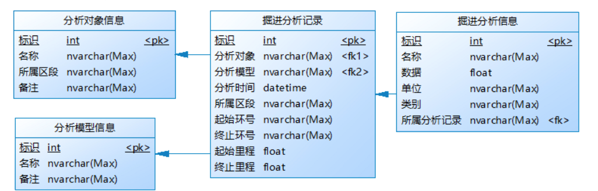

设备名称：**S1245**

PLC系统采集数据获取（注意两条数据的时间间隔为5秒）：

接口url:  http://47.101.219.119:7001

1.按时间获取数据

| 接口类型             | Post                                                         |
| -------------------- | ------------------------------------------------------------ |
| 接口uri              | /api/universal/Monitoring/MonDataEqu_shushui/where?prj=shushui&dataset=3835049491879165952 |
| body参数（json格式） | {"where":"([t]>='2021-09-17 23:56:00' and [t]<='2021-09-17 23:59:00')"} |

PS：

* 通过更改‘t'参数大小来控制数据，更新频率可设为5秒、10秒等。
* 注意查看获取的数据格式，需要的数据位于’data‘下。
* 请参照参数名称表格找到需要的参数列。

2.根据设备编号和模型名称获取分析记录

| 接口类型             | Post                                                         |
| -------------------- | ------------------------------------------------------------ |
| 接口uri              | /api/universal/Structure/TunnelingAnalysisRecord/where?prj=shushui&dataset=3871633455494201344&pagesize={pagesize}&pageindex={pageindex} |
| body参数（json格式） | {"where":"(([AnalysisObject]='S1245') and ([AnalysisModel]='{模型名称}'))"} |

PS：

* 获取最新分析记录：&order=ID&increase=false&pagesize=1&pageindex=1
* 模型名称有两个：“掘进参数优化模型”、“泥水仓压力优化模型”，需分别获取这两个模型的分析记录ID
* S1245是本项目的设备编号
* 从获取的数据中获得recordID，供接口3使用

3.根据分析记录ID获取分析信息

| 接口类型             | POST                                                         |
| -------------------- | ------------------------------------------------------------ |
| 接口uri              | /api/universal/Structure/TunnelingAnalysisInfo/where?prj=shushui&dataset=3871633545889841152 |
| body参数（json格式） | {"where":"([FK_TunnelingAnalysisRecord]=\'{recordID}\')"}    |

