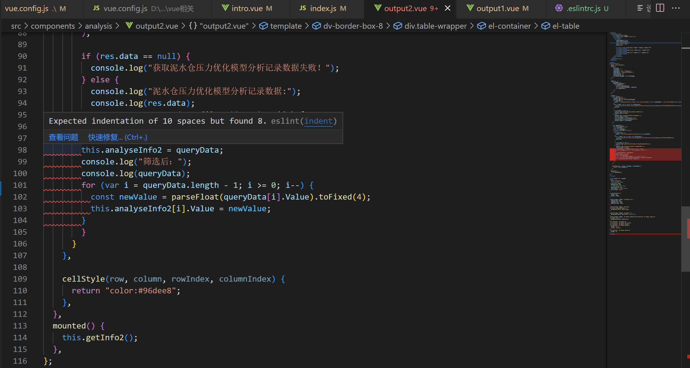
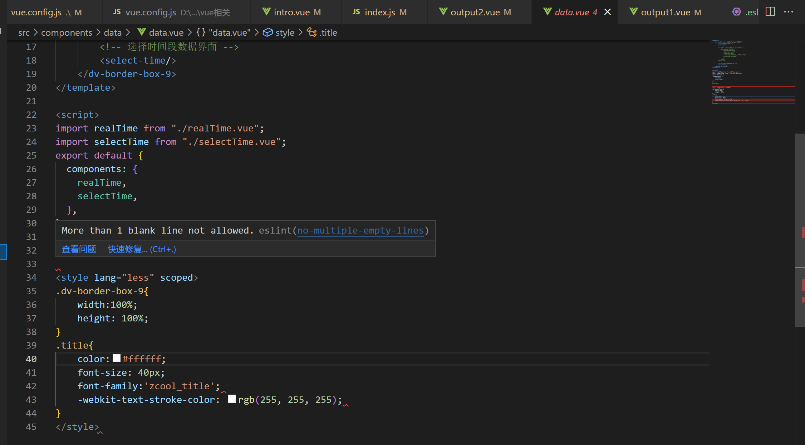
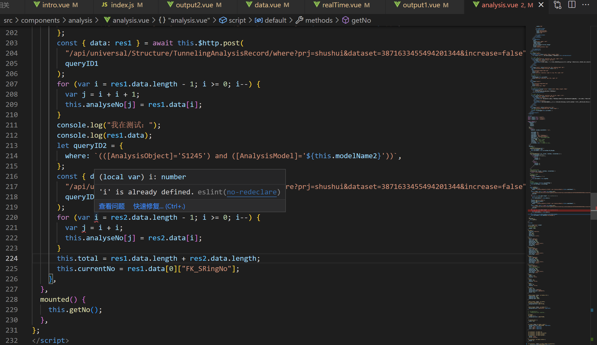
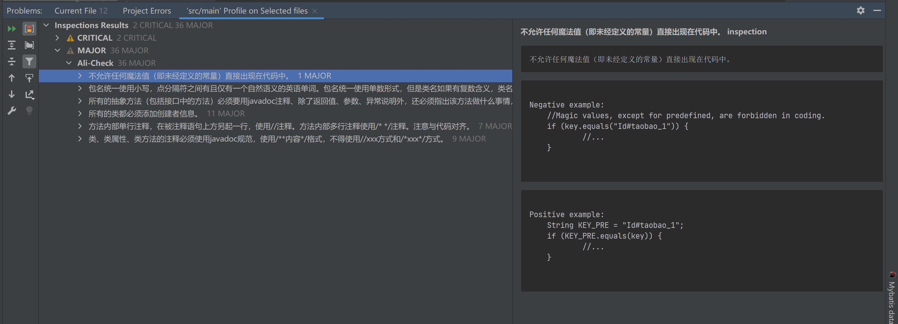

# 一、系统大概需求

## 1.1 项目概述

本项目名称为珠江三角洲水资源配置工程数据可视化，是同济大学软件学院与土木工程学院合作的机器学习项目的成果可视化。

同济大学土木工程学院以珠三角水资源配置工程土建 B3 标 GS5#～GS6#泥水盾构 区间隧道为研究对象，通过不同的机器学习算法和优化算法，研究泥水盾构掘进参数的优化及决策方法。本项目即为对优化结果的可视化展示。

## 1.2 项目范围

本项目与珠江三角洲水资源配置数据管理系统及其业务子系统深度结合，兼具较好的视觉效果和性能稳定的操控。系统集成了工程介绍、掘进参数信息展示、机器学习展示分析的需求，为提升工程管理人员的效率和精准决策提供支撑。

## 1.3 功能简述

用户可以进行注册登录操作，可以浏览盾构机的实时数据，可以按时间查询历史数据，下载所选数据，可以查看机器学习分析结果，可以按环号筛选结果。

# 二、静态测试

## 2.1前端代码质量静态审查

### 2.1.1 工具

我们使用ESLint进行我们的前端代码静态检查，Eslint是一个插件化并且可配置的 JavaScript 语法规则和代码风格的检查工具。

### 2.1.2 测试结果

我们利用eslint检查出了一些代码格式不规范、变量声明未使用或者重复定义的变量。进行了修改。

## 2.2 后端代码质量静态审查

### 2.2.1 工具

我们使用Alibaba Java Coding Guidelines插件进行后端代码静态审查。

为了让开发者更加方便、并且达到快速规范代码格式的目的并实行起来，阿里巴巴基于《阿里巴巴Java开发规约》手册内容，研发了一套自动化的IDE检测插件(IDEA、 Eclipse) 。它就是Alibaba Java Coding Guidelines插件。

### 2.2.2 测试结果

# 三、UserService单元测试

我们选取了UserService类进行单元测试。该类主要维护用户登陆注册的相关功能。我们采用等价类的测试方法，采用自动化测试框架Junit完成。

## 3.1 采用测试方法

- 保证所有的语句、分支被覆盖
- 参考等价类划分方法
- 参考边界值分析方法
- 测试脚本使用python语言实现

## 3.2 测试环境

- Windows11
- MySql
- VS Code
- Intellij IDEA
- Java SDK 8.0

## 3.3 用例分析与设计

### 3.3.1 selectUserName()测试分析与设计

1）标识符定义：UT01

2）被测特性：

- 输入用户名数据库中不存在时，登陆失败
- 输入用户名和密码不匹配时，登陆失败
- 输入用户名和密码匹配时，登录成功

3）测试方法：

参数的等价类划分考虑数据库中存在和不存在两种情况。对于存在情况，又可以划分为匹配和不匹配两种情况。

4）测试项标识：

| 测试项标识符 | 测试项描述             | 优先级 |
| ------------ | ---------------------- | ------ |
| UT01_01      | 输入用户名不存在       | 中     |
| UT01_02      | 输入用户名和密码不匹配 | 高     |
| UT01_03      | 输入用户名和密码匹配   | 低     |

5）测试通过/失败标准

所有的用例都必须被执行，且没有发现错误

6）对应用例

| 测试项编号 | UT01_01                                             |
| ---------- | --------------------------------------------------- |
| 优先级     | 中                                                  |
| 测试项描述 | 输入用户名不存在                                    |
| 输入       | 一个UserBean类（username=“hhh“，password="123abc"） |
| 期望结果   | 返回 “-1”                                           |

| 测试项编号 | UT01_02                                                   |
| ---------- | --------------------------------------------------------- |
| 优先级     | 高                                                        |
| 测试项描述 | 输入用户名和密码不匹配                                    |
| 输入       | 一个UserBean类（username=“yangjing“，password="123abcd"） |
| 期望结果   | 返回 “-1”                                                 |

| 测试项编号 | UT01_03                                                  |
| ---------- | -------------------------------------------------------- |
| 优先级     | 低                                                       |
| 测试项描述 | 输入用户名和密码匹配                                     |
| 输入       | 一个UserBean类（username=“yangjing“，password="123abc"） |
| 期望结果   | 返回 “0”                                                 |

### 3.3.2 addUser()测试分析与设计

1）标识符定义：UT02

2）被测特性：

- 注册的用户名数据库中存在时，失败
- 注册用户名和数据库无重复时，成功

3）测试方法：

参数的等价类划分为已被注册和未被注册两种情况。

4）测试项标识：

| 测试项标识符 | 测试项描述       | 优先级 |
| ------------ | ---------------- | ------ |
| UT02_01      | 输入用户名不重复 | 中     |
| UT02_02      | 输入用户名重复   | 高     |

5）测试通过/失败标准

所有的用例都必须被执行，且没有发现错误

6）对应用例

| 测试项编号 | UT02_01                                              |
| ---------- | ---------------------------------------------------- |
| 优先级     | 中                                                   |
| 测试项描述 | 输入用户名不重复                                     |
| 输入       | 一个UserBean类（username=“test“，password="123abc"） |
| 期望结果   | 返回 “0”                                             |

| 测试项编号 | UT02_02                                                  |
| ---------- | -------------------------------------------------------- |
| 优先级     | 高                                                       |
| 测试项描述 | 输入用户名重复                                           |
| 输入       | 一个UserBean类（username=“yangjing“，password="123abc"） |
| 期望结果   | 返回 “-1”                                                |

### 3.3.3 email()测试分析与设计

1）标识符定义：UT03

2）被测特性：

- 注册的用户名数据库中存在时，失败
- 注册用户名和数据库无重复时，成功

3）测试方法：

参数的等价类划分为已被注册和未被注册两种情况。

4）测试项标识：

| 测试项标识符 | 测试项描述     | 优先级 |
| ------------ | -------------- | ------ |
| UT03_01      | 输入邮箱不重复 | 中     |
| UT03_02      | 输入邮箱重复   | 高     |

5）测试通过/失败标准

所有的用例都必须被执行，且没有发现错误

6）对应用例

| 测试项编号 | UT03_01                              |
| ---------- | ------------------------------------ |
| 优先级     | 中                                   |
| 测试项描述 | 输入邮箱不重复                       |
| 输入       | 一个UserBo类（email=“eess@163.com”） |
| 期望结果   | 返回 “0”                             |

| 测试项编号 | UT03_02                               |
| ---------- | ------------------------------------- |
| 优先级     | 高                                    |
| 测试项描述 | 输入邮箱重复                          |
| 输入       | 一个UserBo类（email=“eess6@163.com”） |
| 期望结果   | 返回 “-1”                             |

我们使用自动化测试框架Junit执行测试用例，执行结果如下。

`
