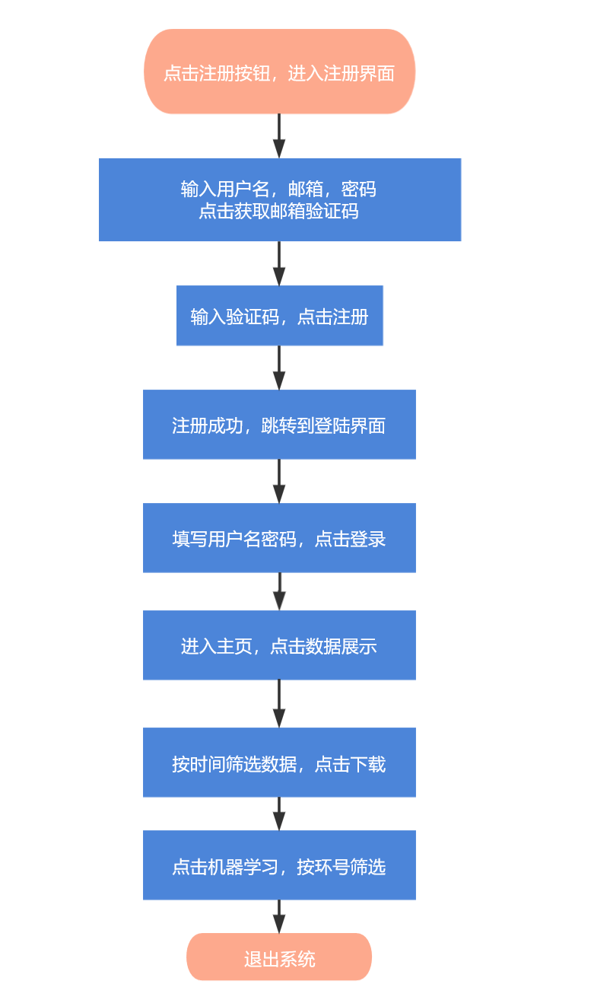

# 一、功能测试

## 1.1 用例设计

我们依据场景法设计了应该test suite

用户首先注册账号，再用刚注册的账号登录界面，进入主页，再进入数据展示界面，按时间筛选数据后下载csv文件，再进入机器学习分析界面，按环号筛选数据，最后退出系统。

用户行为流程图如下：

经过人工验证，系统通过功能测试。

## 1.2 内容测试

### 1.2.1 链接测试

本项目规模较小，因此连接测试由人工完成。

经测试，本系统所链接的页面均存在，Web应用系统上没有孤立的页面（即没有链接指向该页面，即只有知道正确的URL地址才能访问的页面）。

### 1.2.2 表单测试

使用表单进行在线注册登录，要确保提交按钮能正常工作，当完成后应返回成功的消息。并且本系统使用表单收集信息，应确保程序能够正确处理这些数据。

当用户使用表单进行用户注册、登录、信息提交等操作时,必须测试提交操作的完整性,以校验提交给服务器的信息的正确性。

本表单测试在单元测试和集成测试中已经使用自动化测试工具完成，此处不再赘述。

### 1.2.3 cookies测试

禁用浏览器的cookie后，本系统能够在潜在的故障中恢复并正常运行。

进入cookie文件并使用另一个有效/无效的数字编辑当前ID。在编辑之后，本系统显示正确的“拒绝访问”消息。

物理删除cookie并重新测试系统。系统正常运行并向用户提供足够的信息。 

经过以上三方面的测试，本系统通过cookie测试。

# 二、性能测试

我们做了负载压力测试。本系统预计使用人数为30-50人，在测试案例中，我们假设有50个用户在五分钟之内上线，分别用自己的用户名和密码登录本系统。生成的结果报表分析内容如下。

由上图可知，所有的请求均通过，没有存在失败情况。

由上图可知，80%的请求的响应时间基本上都在100ms之内。并且注意到请求/assets/js/chunk-vendors.js-478是耗时较高的请求，后续如果考虑优化可由此入手。

在用户满意度量表中可见，若设置可容忍分界线为500ms，沮丧分界线为1.5s，则可以看到我们的用户满意度为1。

下图为维基百科对Apex方法的说明。

Apdex 方法在 0 到 1 的统一尺度上将许多测量值转换为一个数字（0 = 没有用户满意，1 = 所有用户都满意）。由此产生的 Apdex 分数是用户对企业应用程序性能的满意度的数字度量。

具体数据如上表。

# 三、界面及图形测试

本系统的最终用户群体为珠三角水资源配置工程的施工人员和上层管理工作者。该类人员需要简单易懂的操作，且施工过程需要专心，因此本数据展示系统尽量尽力减少输入的时间和难度，并且数据展示应尽量明显。因此我们的设计策略是避免使用键盘输入，并且展示的信息直观易读。

## 3.1 界面测试

| 项目                       | 检查结果                                     |
| -------------------------- | -------------------------------------------- |
| 页面中各个元素布局的协调性 | 元素布局合理协调                             |
| 不同页面风格的统一性       | 登陆注册表单风格与整体风格略有出入           |
| 用户在界面中操作的便利性   | 操作便利                                     |
| 界面动态操作测试           | 初次检查发现背景图片无法根据窗口大小动态适应 |

我们在界面测试中发现登陆注册表单风格与整体风格略有出入，进行了美化修改

登陆界面修改前：

登陆界面修改后：

注册界面修改：

注册界面修改后：

## 3.2 图形测试

| 项目                             | 检查结果 |
| -------------------------------- | -------- |
| 图形是否都有明确的用途           | 是       |
| 所有页面字体的颜色、风格是否统一 | 是       |
| 背景颜色和字体颜色是否搭配       | 是       |
| 图片大小和质量是否达到要求       | 是       |
| 图片尺寸是否合适                 | 是       |

# 四、兼容性测试

## 4.1 平台测试

在Web系统发布之前,需要在各种操作系统下对Web系统进行兼容性测试。

经调查，本系统的使用者使用windows操作系统和Mac操作系统，经试验发现本系统在两种平台上均可以正常运行。

## 4.2 浏览器测试

浏览器是Web客户端ui核心的构件，来自不同厂商的浏览器对JavaScript，HTML规格有不同的支持。经过测试，本系统在不同浏览器的常见版本下均可以正常工作。

## 4.3 分辨率测试

经测试，页面版式在640x400，600x800，1024x768的分辨率模式下均显示正常，字体正常，文本和图片也对齐。
