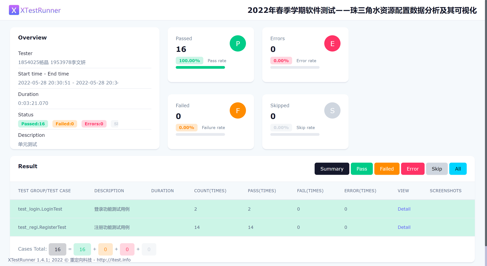
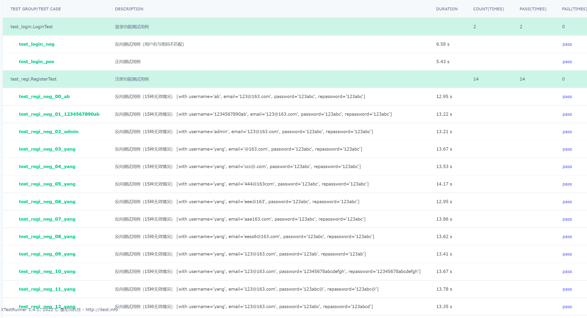
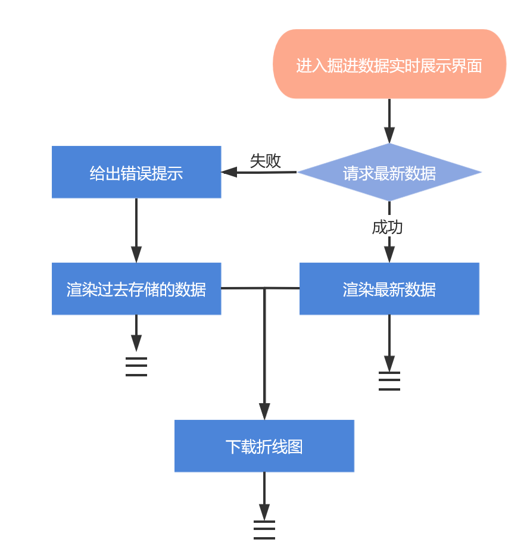
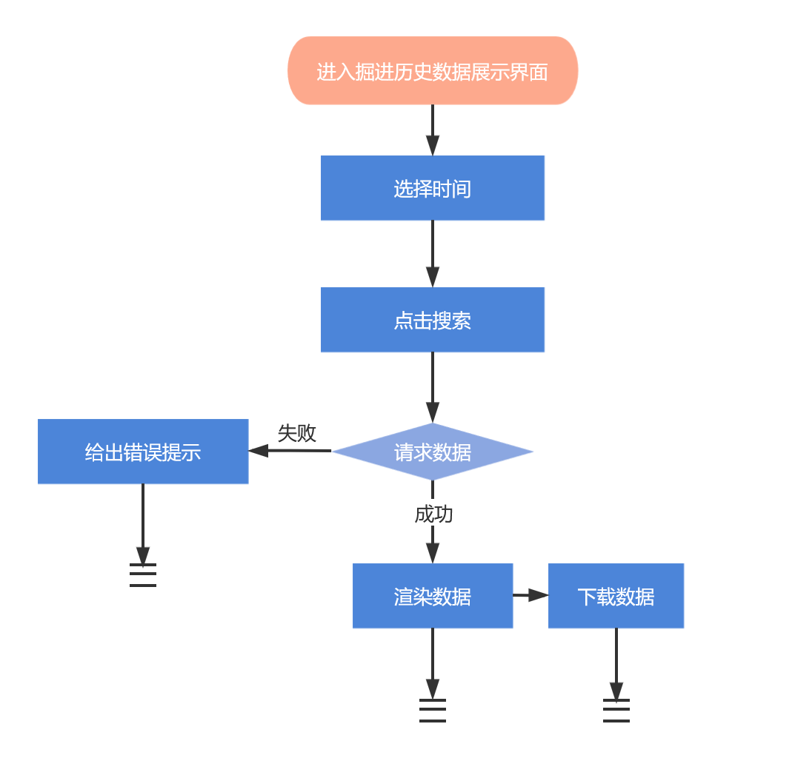
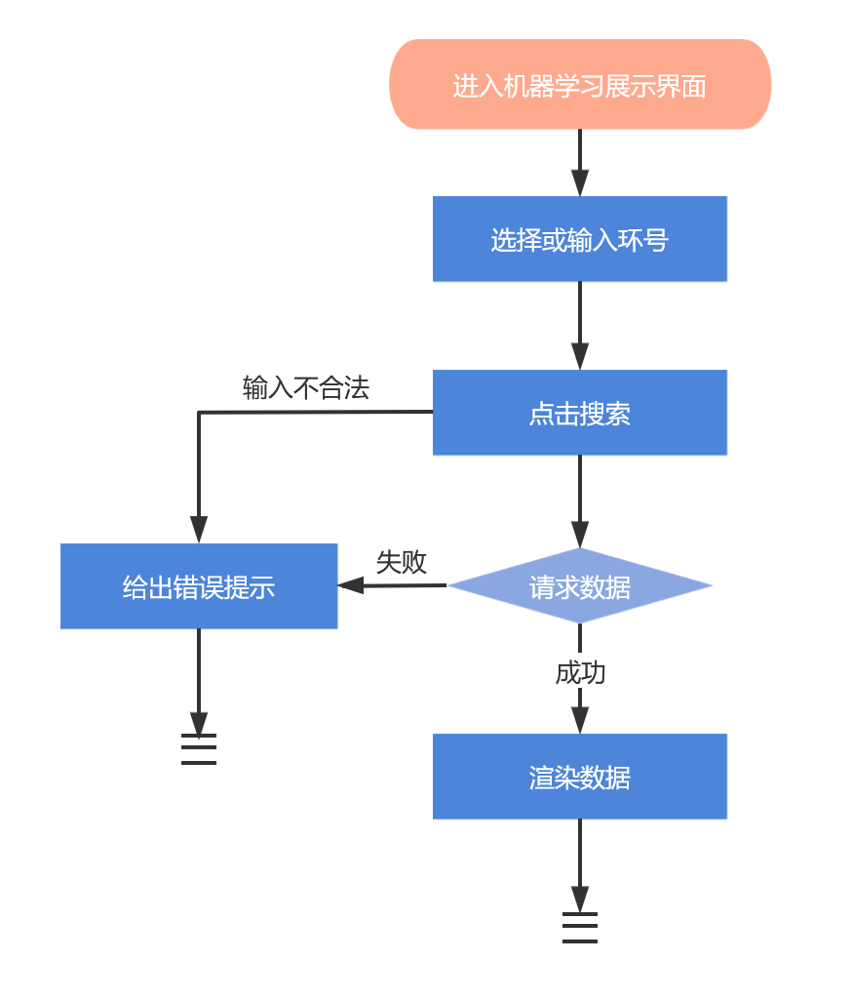
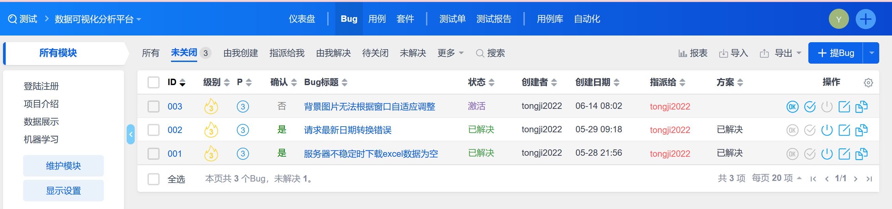
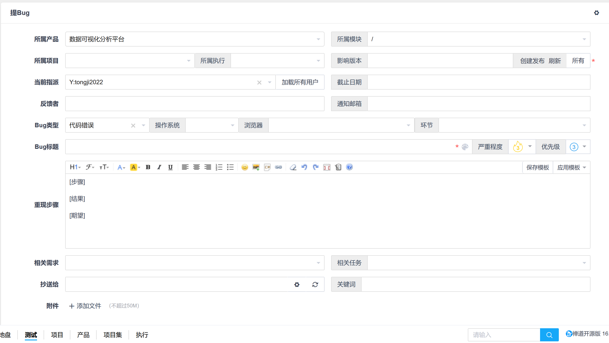
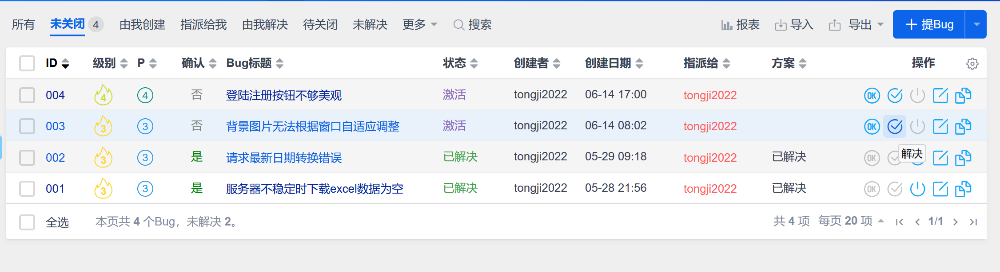
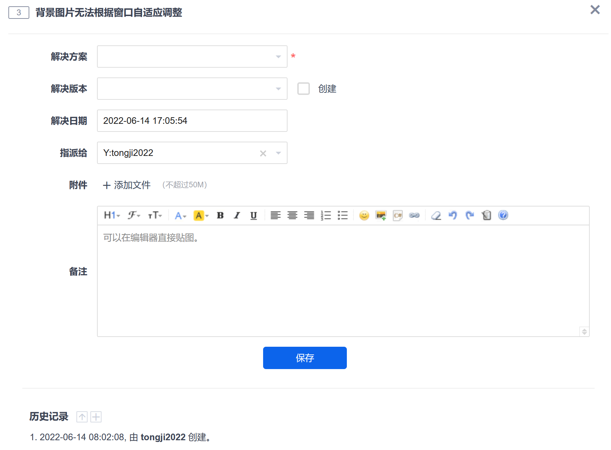

# 一、测试概述

本集成测试模块主要实现登陆注册模块和界面模块的集成，以及界面模块和第三方数据库模块的集成。

## 1.1 集成测试接口分析

登陆注册与界面接口如下

| 接口序号    | 接口描述       |
| ----------- | -------------- |
| API_INT_001 | 登录按钮       |
| API_INT_002 | 注册按钮       |
| API_INT_003 | 发送邮箱验证码 |

系统和第三方系统接口如下：

| 接口序号    | 接口描述                           |
| ----------- | ---------------------------------- |
| PLC_INT_001 | 按时间获取数据                     |
| PLC_INT_002 | 根据设备编号和模型名称获取分析记录 |
| PLC_INT_003 | 根据分析记录ID获取分析信息         |

经分析，以上接口均需要被测试。

## 1.2 采用的测试方法和技术

对于UserService类和界面的http请求接口，参考等价类设计方法，使用自动化框架Selenium完成。

对于界面接口，利用场景法设计测试用例，根据用例进行手动验证其功能,同时关注其是否调用正确的接口函数,并且是否能够正确地传递输人参数,正确地获取返回值和输出参数。

## 3.2 测试环境

- Windows11
- MySql
- VS Code
- Intellij IDEA
- Java SDK 8.0

# 二、UserService与界面接口模块

## 2.1 采用测试方法

- 保证所有的语句、分支被覆盖
- 参考等价类划分方法
- 参考边界值分析方法
- 测试脚本使用python语言实现（Unittest+Selenium）

## 2.2 测试环境

- Windows11
- MySql
- VS Code
- Intellij IDEA
- Python3.10
- Java SDK 8.0

## 2.3  登录测试分析与设计

1）标识符定义：IT01

2）被测特性：

- 输入用户名不存在时，登陆失败
- 输入用户名和密码不匹配时，登陆失败
- 输入任意参数为空时候，登录失败
- 输入参数合法时，登录成功

3）测试方法：

用户账户参数的等价类划分考虑空和非空情况。对于非空情况，又可以划分为数据库中存在和不存在两种情况。
密码参数的等价类划分考虑空和非空情况。对于非空情况，又可以划分为与管理员账户匹配与不匹配两种情况。

4）测试项标识：

| 测试项标识符 | 测试项描述             | 优先级 |
| ------------ | ---------------------- | ------ |
| IT01_01      | 输入用户名不存在       | 中     |
| IT01_02      | 输入用户名和密码不匹配 | 高     |
| IT01_03      | 输入任意参数为空       | 低     |
| IT01_04      | 输入参数合法           | 高     |

5）测试通过/失败标准

所有的用例都必须被执行，且没有发现错误

6）对应用例

| 测试项编号 | IT01_01                               |
| ---------- | ------------------------------------- |
| 优先级     | 中                                    |
| 测试项描述 | 输入用户名不存在                      |
| 前置条件   | 用户进入登录界面                      |
| 输入       | username=“hhh“ password="123abc" |
| 期望结果   | 登陆失败，显示用户名不存在            |

| 测试项编号 | IT01_02                                     |
| ---------- | ------------------------------------------- |
| 优先级     | 高                                          |
| 测试项描述 | 输入用户名和密码不匹配                      |
| 前置条件   | 用户进入登录界面                            |
| 输入       | username=“yangjing“ password="1234abc" |
| 期望结果   | 登陆失败，显示密码错误                      |

| 测试项编号 | IT01_03                              |
| ---------- | ------------------------------------ |
| 优先级     | 低                                   |
| 测试项描述 | 输入任意参数为空                     |
| 前置条件   | 用户进入登录界面                     |
| 输入       | username=““ password="123abc"   |
| 期望结果   | 登陆失败，仍然停留在登陆界面         |
| 输入       | username=“yangjing“ password="" |
| 期望结果   | 登陆失败，仍然停留在登陆界面         |

| 测试项编号 | IT01_04                                      |
| ---------- | -------------------------------------------- |
| 优先级     | 高                                           |
| 测试项描述 | 输入参数合法                                 |
| 前置条件   | 用户进入登录界面                             |
| 输入       | username=“ yangjing “ password="123abc" |
| 期望结果   | 登陆成功，跳转到主页                         |

## 2.4注册测试分析与设计

1）标识符定义：IT02

2）被测特性：

- 输入用户名需要在3-10个字符，否则注册失败
- 输入密码需要在6-15个字符，由字母和数字组成，不可以有特殊符号，否则注册失败
- 输入邮箱不合法时，注册失败
- 再次确认输入密码和第一次不一样时注册失败
- 输入任意参数为空时候，注册失败
- 输入参数合法时，注册成功

3）测试方法：

用户账户参数的等价类划分考虑空和非空情况。对于非空情况，又可以划分为已被注册和未被注册两种情况，未被注册又分为符合长度要求和不符合长度要求两种情况。

邮箱参数的等价类划分考虑合法和不合法情况。

密码参数的等价类划分考虑空和非空情况。对于非空情况，又可以划分为与符合长度要求且符合组成要求、不符合长度要求但符合组成要求、符合长度要求但不符合组成要求、符合长度要求但不符合组成要求四种情况。

另外补充两次输入密码不一致的情况

4）测试项标识：

| 测试项标识符 | 测试项描述           | 优先级 |
| ------------ | -------------------- | ------ |
| IT02_01      | 输入用户名低于3位    | 中     |
| IT02_02      | 输入用户名高于10位   | 中     |
| IT02_03      | 输入用户名已经被注册 | 高     |
| IT02_04      | 邮箱格式错误         | 高     |
| IT02_05      | 邮箱已经被注册       | 高     |
| IT02_06      | 密码低于6位          | 中     |
| IT02_07      | 密码高于15位         | 中     |
| IT02_08      | 密码包含特殊字符     | 中     |
| IT02_09      | 密码两次输入不一致   | 低     |
| IT02_10      | 输入参数有空值       | 低     |
| IT02_11      | 输入参数均合法       | 低     |

5）测试通过/失败标准

所有的用例都必须被执行，且没有发现错误

6）对应用例

| 测试项编号 | IT01_01                                                      |
| ---------- | ------------------------------------------------------------ |
| 优先级     | 中                                                           |
| 测试项描述 | 输入用户名低于3位                                            |
| 前置条件   | 用户进入注册界面                                             |
| 输入       | username=“ab“ email=”123@163.com“ password="123abc" repassword=”123abc“ |
| 期望结果   | 注册失败，提示请输入正确的信息                               |

| 测试项编号 | IT01_02                                                      |
| ---------- | ------------------------------------------------------------ |
| 优先级     | 中                                                           |
| 测试项描述 | 输入用户名高于10位                                           |
| 前置条件   | 用户进入注册界面                                             |
| 输入       | username=“1234567890ab“ email=”123@163.com“ password="123abc" repassword=”123abc“ |
| 期望结果   | 注册失败，提示请输入正确的信息                               |

| 测试项编号 | IT01_03                                                      |
| ---------- | ------------------------------------------------------------ |
| 优先级     | 高                                                           |
| 测试项描述 | 输入用户名已经被注册                                         |
| 前置条件   | 用户进入注册界面                                             |
| 输入       | username=“admin“ email=”123@163.com“ password="123abc" repassword=”123abc“ |
| 期望结果   | 注册失败，提示用户名已存在                                   |

| 测试项编号 | IT01_04                                                      |
| ---------- | ------------------------------------------------------------ |
| 优先级     | 高                                                           |
| 测试项描述 | 邮箱格式错误                                                 |
| 前置条件   | 用户进入注册界面                                             |
| 输入       | username=“admin“ email=”@163.com“或”ccc@.com“ 或 ”444@163com“或"ee@163" password="123abc" repassword=”123abc“ |
| 期望结果   | 注册失败，提示邮箱格式错误                                   |

| 测试项编号 | IT01_05                                                      |
| ---------- | ------------------------------------------------------------ |
| 优先级     | 高                                                           |
| 测试项描述 | 邮箱已经被注册                                               |
| 前置条件   | 用户进入注册界面                                             |
| 输入       | username=“yang“ email=”@163.com“或”ccc@.com“ 或 ”444@163com“或"ee@163" password="123abc" repassword=”123abc“ |
| 期望结果   | 注册失败，提示邮箱已经被注册                                 |

| 测试项编号 | IT01_06                                                      |
| ---------- | ------------------------------------------------------------ |
| 优先级     | 中                                                           |
| 测试项描述 | 密码低于6位                                                  |
| 前置条件   | 用户进入注册界面                                             |
| 输入       | username=“yang“ email=”123@163.com“ password="12abc" repassword=”12abc“ |
| 期望结果   | 注册失败，提示密码应在6-15位之间                             |

| 测试项编号 | IT01_07                                                      |
| ---------- | ------------------------------------------------------------ |
| 优先级     | 中                                                           |
| 测试项描述 | 输入密码高于15位                                             |
| 前置条件   | 用户进入注册界面                                             |
| 输入       | username=“yang“ email=”123@163.com“ password="1234567abcdefgh" repassword=”1234567abcdefgh“ |
| 期望结果   | 注册失败，提示密码应在6-15位之间                             |

| 测试项编号 | IT01_08                                                      |
| ---------- | ------------------------------------------------------------ |
| 优先级     | 中                                                           |
| 测试项描述 | 输入密码包括特殊字符                                         |
| 前置条件   | 用户进入注册界面                                             |
| 输入       | username=“yang“ email=”123@163.com“ password="123abc@" repassword=”123abc@“ |
| 期望结果   | 注册失败，提示密码应该由字母和数字组成                       |

| 测试项编号 | IT01_09                                                      |
| ---------- | ------------------------------------------------------------ |
| 优先级     | 低                                                           |
| 测试项描述 | 两次输入密码不一致                                           |
| 前置条件   | 用户进入注册界面                                             |
| 输入       | username=“yang“ email=”123@163.com“ password="123abc@" repassword=”123abc@“ |
| 期望结果   | 注册失败，提示两次输入密码不一致                             |

| 测试项编号 | IT01_10                                                      |
| ---------- | ------------------------------------------------------------ |
| 优先级     | 低                                                           |
| 测试项描述 | 输入项有空置                                                 |
| 前置条件   | 用户进入注册界面                                             |
| 输入       | username=“ “ email=”123@163.com“ password="123abc" repassword=”123abc“ |
| 期望结果   | 注册失败，提示请输入用户名                                   |

| 测试项编号 | IT01_10                                                      |
| ---------- | ------------------------------------------------------------ |
| 优先级     | 低                                                           |
| 测试项描述 | 输入项有空值                                                 |
| 前置条件   | 用户进入注册界面                                             |
| 输入       | username=“ “ email=”123@163.com“ password="123abc" repassword=”123abc“ |
| 期望结果   | 注册失败，提示请输入用户名                                   |

| 测试项编号 | IT01_11                                                      |
| ---------- | ------------------------------------------------------------ |
| 优先级     | 低                                                           |
| 测试项描述 | 输入参数均合法                                               |
| 前置条件   | 用户进入注册界面                                             |
| 输入       | username=“yang“ email=”123@163.com“ password="123abc" repassword=”123abc“ |
| 期望结果   | 注册成功，跳转到登录界面                                     |

我们使用自动化测试脚本进行测试，最终测试结果生成了html格式的报告如下：

# 三、系统和第三方系统接口

## 3.1 采用测试方法

- 保证所有的语句、分支被覆盖
- 参考场景法
- 测试手动完成

## 3.2 测试环境

- Windows11
- MySql
- VS Code
- Intellij IDEA
- Java SDK 8.0

## 3.3 实时数据展示测试分析与设计

1）标识符定义：IT03

2）被测特性：

- 可以展示最新的掘进数据
- 第三方数据接口不稳定时给出提示

3）测试方法：

采用场景法，人工测试。

4）基本流和备选流分析：

| 名称    | 内容                                                         |
| ------- | ------------------------------------------------------------ |
| 基本流  | 用户进入实时掘进数据界面，系统向第三方接口请求数据，获取到数据后渲染到界面上 |
| 备选流1 | 获取数据失败，给出错误提示（服务器不稳定），渲染之前存储的数据 |
| 备选流2 | 下载折线图                                                   |

场景设计列表：

| 场景编号                 | 内容   |           |         |
| ------------------------ | ------ | --------- | ------- |
| 场景1-实时数据获取成功   | 基本流 |           |         |
| 场景2-第三方服务器不稳定 | 基本流 | 备选流1   |         |
| 场景3-用户下载折线图     | 基本流 | 备选流1/2 | 备选流3 |

5）测试通过/失败标准

所有的用例都必须被执行，且没有发现错误

6）对应用例

| 用例编号 | 场景                                   | 优先级 | 预期结果                       |
| -------- | -------------------------------------- | ------ | ------------------------------ |
| IT03_01  | 场景1-实时数据获取成功                 | 中     | 界面展示最新一个小时的数据     |
| IT03_02  | 场景2-实时数据获取成功，用户下载折线图 | 低     | 下载导出png图片                |
| IT03_03  | 场景2-第三方服务器不稳定               | 中     | 界面给出错误提示，展示历史数据 |

## 3.4 历史数据筛选测试分析与设计

1）标识符定义：IT04

2）被测特性：

- 可以根据时间段筛选数据
- 第三方数据接口不稳定时给出提示
- 可以下载所选时间段的数据

3）测试方法：

采用场景法，人工测试。

4）基本流和备选流分析：

| 名称    | 内容                                                         |
| ------- | ------------------------------------------------------------ |
| 基本流  | 用户进入历史掘进数据界面，选择时间段，点击搜索按钮，系统向第三方接口请求数据，获取到数据后渲染到界面上 |
| 备选流1 | 获取数据失败，给出错误提示（服务器不稳定）                   |
| 备选流2 | 获取数据后用户点击下载数据按钮，导出数据为excel文件          |

场景设计列表：

| 场景编号                 | 内容   |         |
| ------------------------ | ------ | ------- |
| 场景1-历史数据获取成功   | 基本流 |         |
| 场景2-第三方服务器不稳定 | 基本流 | 备选流1 |
| 场景3-用户下载相关数据   | 基本流 | 备选流2 |

5）测试通过/失败标准

所有的用例都必须被执行，且没有发现错误

6）对应用例

| 用例编号 | 场景                     | 优先级 | 预期结果                  |
| -------- | ------------------------ | ------ | ------------------------- |
| IT04_01  | 场景1-历史数据获取成功   | 中     | 界面展示所选时间段的数据  |
| IT04_02  | 场景2-第三方服务器不稳定 | 中     | 界面展示历史数据          |
| IT04_03  | 场景3-用户下载相关数据   | 高     | 浏览器导出下载的excel文件 |

## 3.5 机器学习数据展示测试分析与设计

1）标识符定义：IT05

2）被测特性：

- 可以根据环号筛选数据
- 第三方数据接口不稳定时给出提示

3）测试方法：

采用场景法，人工测试。

4）基本流和备选流分析：

| 名称    | 内容                                                         |
| ------- | ------------------------------------------------------------ |
| 基本流  | 用户进入机器学习展示界面，选择或输入环号，点击搜索按钮，系统向第三方接口请求数据，获取到数据后渲染到界面上 |
| 备选流1 | 获取数据失败，给出错误提示                                   |

场景设计列表：

| 场景编号                       | 内容   |         |
| ------------------------------ | ------ | ------- |
| 场景1-按环号筛选数据成功       | 基本流 |         |
| 场景2-输入不合法或服务器不稳定 | 基本流 | 备选流1 |

5）测试通过/失败标准

所有的用例都必须被执行，且没有发现错误

6）对应用例

| 用例编号 | 场景                           | 优先级 | 预期结果               |
| -------- | ------------------------------ | ------ | ---------------------- |
| IT05_01  | 场景1-按环号筛选数据成功       | 中     | 界面展示所选环号的数据 |
| IT05_02  | 场景2-输入不合法或服务器不稳定 | 中     | 界面给出错误提示       |

# 四、缺陷跟踪工具

在单元测试和集成测试的过程中，我们采用的缺陷管理工具是禅道

缺陷管理流程如下：

Step1：提Bug。界面如下，可以对bug进行详细描述，可以选择bug类型，出现bug时的操作系统，浏览器，编辑重现步骤。并可以指派特定人员维修bug，设定截止日期，优先级。

Step2：被指派的人看到了bug，维修成功后可以点击解决按钮。

并且可以详细描述解决方案。

Step3：最终提bug的人在检查无误后，可以点击结束bug。

